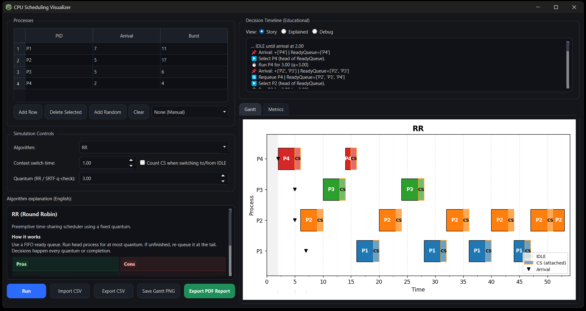
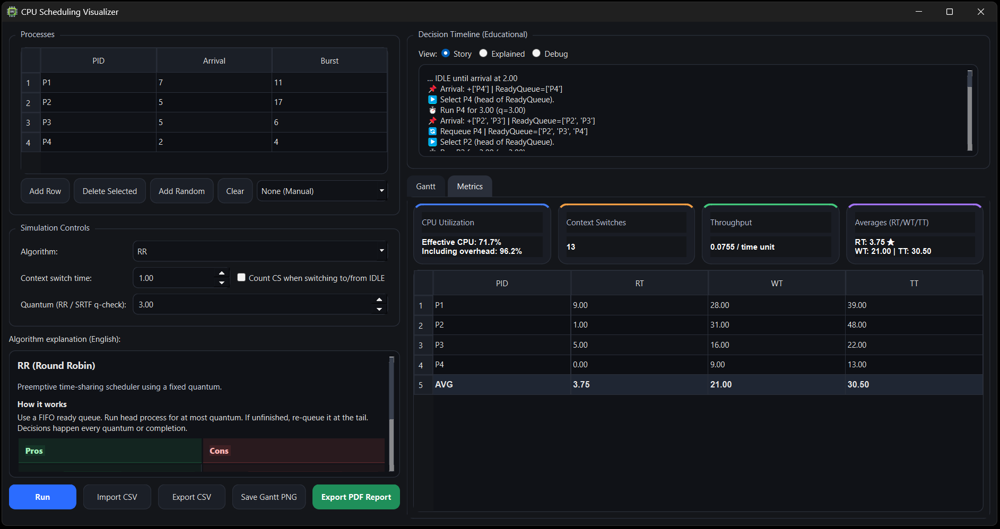

# CPU Scheduling Visualizer (PyQt6 + Matplotlib)

A dark-themed, educational CPU Scheduling simulator and visualizer built with **PyQt6** and **Matplotlib**.

This application was developed as a final course project for an undergraduate **Principles of Computer Systems** course.  
It provides an interactive and analytical environment for studying classical CPU scheduling algorithms, visualizing execution timelines, and evaluating performance metrics.

---

## 🖥️ Screenshots





---

## ✨ Core Features

### 🧮 Supported Scheduling Algorithms

- **FIFO / FCFS** (First-Come, First-Served)
- **SJF / SPN** (Shortest Job First / Shortest Process Next)
- **HRRN** (Highest Response Ratio Next)
- **RR** (Round Robin)
- **SRTF (continuous)** – Fully preemptive shortest remaining time
- **SRTF (quantum-check)** – Preemption evaluated at slice boundaries
- **MLQ** (Multi-Level Queue – fixed priority queues)
- **MLFQ** (Multi-Level Feedback Queue – dynamic priority adjustment)

MLFQ includes optional **aging** to reduce starvation in lower-priority queues.

---

### 📊 Gantt Chart Visualization

- Dark-themed timeline rendering
- Color-coded processes
- Context switch (CS) segments clearly attached to running blocks
- IDLE periods highlighted
- Optional arrival markers
- Queue-aware visualization for MLQ / MLFQ

The Gantt chart dynamically reflects:
- Preemption
- Context switch overhead
- Queue transitions
- CPU utilization structure

---

### 📈 Performance Metrics

For each process:

- **RT** – Response Time  
- **WT** – Waiting Time  
- **TT** – Turnaround Time  

Global system metrics:

- CPU Utilization (RUN only)
- CPU Utilization (RUN + Context Switch)
- Throughput
- Total Context Switches
- Average RT / WT / TT

This allows direct comparison between scheduling strategies.

---

### 🧠 Educational Decision Timeline

Three timeline modes:

- **Story Mode** – Simplified human-readable explanation
- **Explained Mode** – Structured algorithm reasoning
- **Debug Mode** – Full event log including:
  - Arrivals
  - Queue updates
  - Re-queues
  - Preemptions
  - Context switches
  - Aging promotions

This component turns the simulator into a teaching tool rather than just a visualizer.

---

### 🎯 Preset Educational Scenarios

Predefined workload presets are included to demonstrate:

- Convoy effect (FCFS worst-case behavior)
- Starvation scenarios
- Interactive vs CPU-bound workloads
- Mixed workloads
- Real-time short job bursts
- MLQ class separation
- MLFQ aging behavior

---

### 📄 Export Capabilities

- Export process table to **CSV**
- Import process table from **CSV**
- Save Gantt chart as **PNG**
- Generate a detailed **PDF report** including:
  - System metrics
  - Per-process metrics
  - Algorithm description
  - Pros & Cons comparison
  - Landscape Gantt visualization

---

## 📄 Sample Generated Report

A sample PDF report generated by the application is available here:

assets/sample_report.pdf

---

## ⚙️ Installation

```bash
python -m venv .venv
# Windows:
.venv\Scripts\activate
pip install -r requirements.txt
```

---

## ▶️ Run

```bash
python src/main.py
```

---

## 🎓 Academic Context

This project was developed as the final course project for the **Principles of Computer Systems** course.

While the assignment required the implementation of a CPU scheduling simulator, this version was extended significantly beyond the minimum requirements.  
It includes advanced visualization, detailed performance analytics, multiple scheduling variants, configurable context-switch overhead, optional aging mechanisms, preset educational scenarios, and automated PDF reporting.

The project was formally presented and evaluated at the end of the semester.

---

## Supervision

This project was developed and presented under the instruction of:

Dr. Ali Jamalian  
Google Scholar: https://scholar.google.com/citations?user=TRMcm8sAAAAJ&hl=en